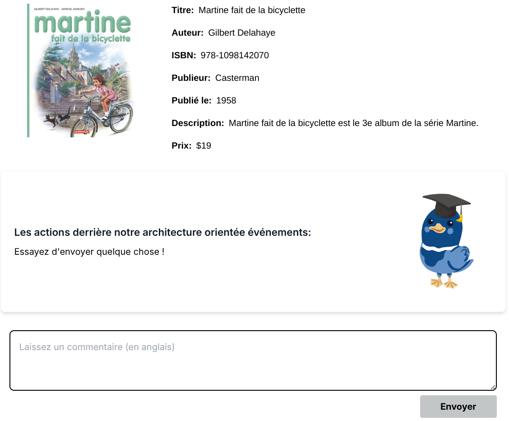
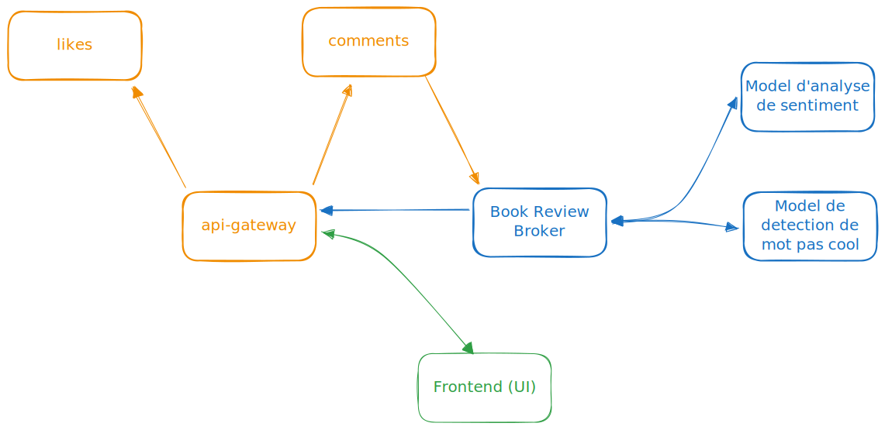

# Knative-Project
## Authors
- **Baptiste BRONSIN**: [website 🔗](https://baptistebronsin.be)
- **Benoit PLANCHE**

## Description
This project display the description of a book and allows users to send comments about it. Each comment is sent to a Broker and then multiple functions are triggered to process the comment:
- **Bad Words Filter**: Filter out bad words from the comment
- **Sentiment Analysis**: Analyze the sentiment of the comment

At the end, the comment is sent by websocket to the frontend.

Here is the user interface:


## Goal
The goal of this project is to demonstrate the use of Knative and its components with FaaS (Function as a Service) and with a microservices architecture.

## Architecture


The green component is the frontend, the orange components are the microservices and the blue components are the Knative components.

## How to run
### Requirements
1. Kubernetes cluster (be careful to have the correct kubecontext)
2. Knative client installed (CLI: [documentation 🔗](https://knative.dev/docs/client/install-kn))

### Steps
1. Clone the repository
```bash
git clone https://github.com/baptistebronsin/knative-project.git
cd knative-project
```

2. Run the `setup.sh` script to delpoy all Knative basic components in your Kubernetes cluster
```bash
chmod +x ./setup.sh
./setup.sh
```

3. Deploy the frontend
```bash
kubectl apply -f ./infra/frontend.yaml
```

4. Deploy the GO microservices
```bash
kubectl apply -f ./infra/likes.yaml
kubectl apply -f ./infra/comments.yaml
kubectl apply -f ./infra/api-gateway.yaml
```

5. Deploy the broker
```bash
kubectl apply -f ./infra/broker.yaml
```

6. Deploy the Knative services
```bash
kubectl apply -f ./infra/event-display.yaml
kubectl apply -f ./infra/log-trigger.yaml
kubectl apply -f ./infra/sinkbinding.yaml
```

7. Deploy the functions
```bash
cd bad-word-filter
func deploy --build=false --push=false --image=registry.gitlab.com/baptiste.bronsin/knative/bad-word-filter:latest -v
cd ..
```

```bash
cd sentiment-analysis-app
func deploy --build=false --push=false --image=registry.gitlab.com/baptiste.bronsin/knative/sentiment-analysis-app:latest -v
cd ..
```

8. Deploy the Knative sequences
```bash
kubectl apply -f ./sequence/config
```

9. Port-forward the frontend to access it
```bash
kubectl port-forward svc/bookstore-frontend-svc 3000:3000
```

It will be accessible at `http://localhost:3000`

10. Port-forward the backend to access it
```bash
kubectl port-forward svc/node-server-svc 8080:80
```

It will be accessible at `http://localhost:8080`

That's it! You can now test the application by sending comments and see the result in the frontend.

## Other
There is a `docker-compose.yaml` file in the root of the repository to run the frontend and backend locally.  It has been used for development purposes.